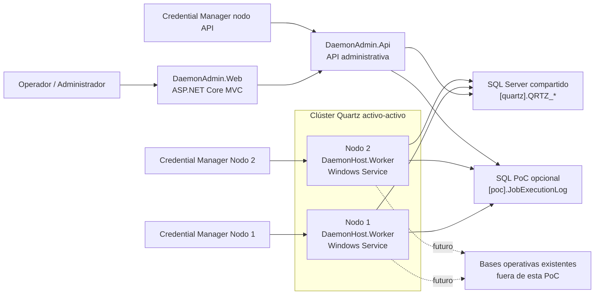
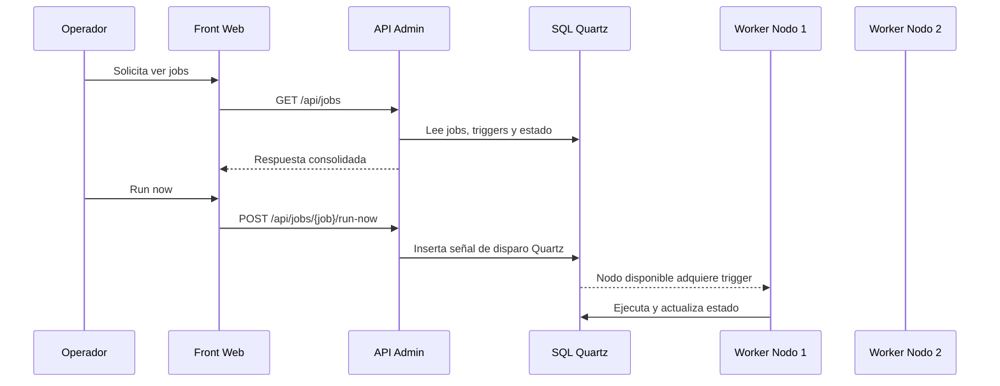

# 2. Arquitectura de alto nivel

## Problema

Hoy no existe una plataforma moderna, centralizada y trazable para ejecutar demonios/workers con failover y control operativo entre dos nodos equivalentes en Windows Server 2019.

## Objetivos

- Ejecutar Quartz.NET en clúster activo-activo entre dos nodos.
- Persistir Quartz en SQL Server compartido.
- Administrar jobs desde un front y una API.
- Separar completamente Quartz de las bases operativas del negocio.
- Resolver secretos temporalmente con Credential Manager sin hardcodeo.

## Alcance

- front administrativo,
- API administrativa/control,
- worker host,
- persistencia Quartz,
- jobs demo,
- historial PoC opcional,
- despliegue base en IIS + Windows Service.

## Restricciones

- Windows Server 2019.
- `.NET 10`.
- secretos temporales en Windows Credential Manager.
- sin Key Vault en esta fase.
- sin tocar bases operativas reales del negocio.
- Quartz con SQL Server y clúster habilitado.

## Diagrama de alto nivel

## Explicación por componente

### Front

`DaemonAdmin.Web` presenta una consola administrativa sencilla para:

- ver el estado general,
- revisar jobs,
- disparar `run-now`,
- pausar,
- reanudar,
- consultar historial.

### API

`DaemonAdmin.Api` expone endpoints administrativos. Su responsabilidad es:

- consultar jobs y triggers,
- consultar estado de clúster,
- pedir acciones administrativas,
- exponer health/status.

### Worker Host

`DaemonHost.Worker` aloja Quartz como Windows Service y ejecuta jobs reales. En esta PoC:

- registra `JobDemoRapido`,
- registra `JobDemoLento`,
- se une al clúster Quartz,
- y deja evidencia del nodo ejecutor.

### SQL compartido de Quartz

Es el corazón del clúster. Allí Quartz persiste:

- jobs,
- triggers,
- locks,
- fired triggers,
- scheduler state,
- calendarios y metadata interna.

Sin este SQL compartido no existe clustering real de Quartz.

## Flujo de administración y ejecución

## Por qué Quartz necesita persistencia propia

Quartz no es solo un cron embebido. Para clustering y durabilidad necesita persistir:

- scheduler state por nodo,
- locks distribuidos,
- triggers disparados,
- definiciones de job/trigger,
- reintentos, recovery y misfires.

Por eso:

- no debe usar tablas de negocio,
- no debe mezclarse con esquemas operativos ajenos,
- y ambos nodos deben apuntar exactamente al mismo almacenamiento Quartz.
