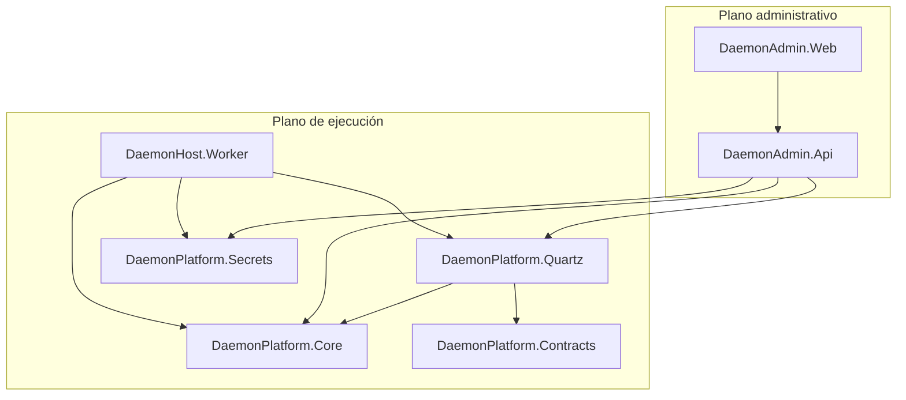
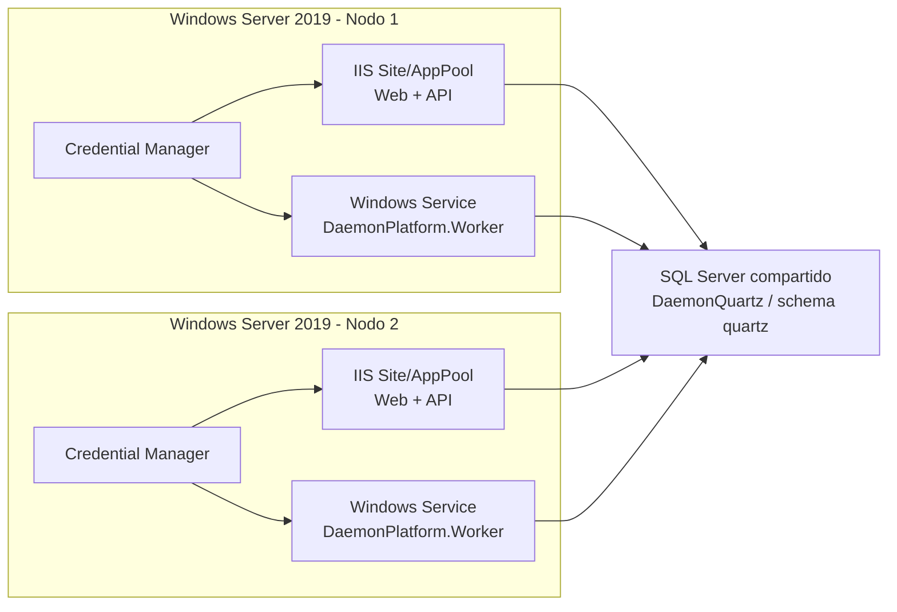
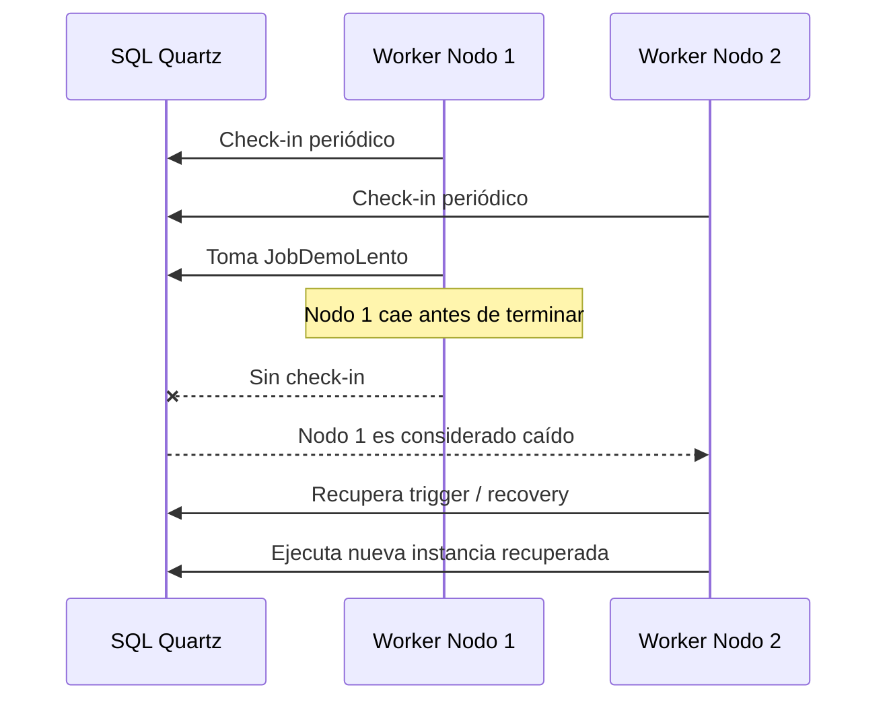

# 3. Arquitectura detallada

## Vista lógica

## Vista física

- `Nodo 1`: IIS opcional para front/API y Windows Service para Worker.
- `Nodo 2`: IIS opcional para front/API y Windows Service para Worker.
- `SQL Server compartido`: esquema `[quartz]` obligatorio y esquema/tablas PoC opcionales.

## Vista de despliegue

## Vista de componentes

### `DaemonAdmin.Web`

- UI administrativa.
- Consumidor HTTP de la API.
- No toca SQL directamente.

### `DaemonAdmin.Api`

- Endpoints de control.
- Consulta estado del scheduler y del clúster.
- Ejecuta `run-now`, `pause`, `resume`.
- Expone health checks.

### `DaemonHost.Worker`

- Inicializa Quartz.
- Se une al clúster.
- Registra jobs demo.
- Ejecuta jobs y escribe evidencia.

### `DaemonPlatform.Quartz`

- construcción de propiedades Quartz,
- bootstrap de jobs,
- job factory con DI,
- repositorio de estado del clúster,
- servicio administrativo,
- health check de almacenamiento,
- store PoC de historial.

### `DaemonPlatform.Secrets`

- implementación `CredentialManagerSecretProvider`,
- mapeo de nombre lógico a target de Credential Manager.

## Responsabilidades por componente

| Componente | Responsabilidad |
|---|---|
| Web | Vista operativa |
| API | Orquestación administrativa |
| Worker | Ejecución Quartz |
| SQL Quartz | Estado transaccional del scheduler |
| Credential Manager | Secretos temporales por nodo |
| Base operativa futura | Solo lógica de negocio, fuera de esta PoC |

## Flujo de clustering

1. `Nodo 1` y `Nodo 2` arrancan el Worker.
2. Ambos usan el mismo `quartz.scheduler.instanceName`.
3. Cada nodo usa `instanceId` distinto o `AUTO`.
4. Ambos apuntan a las mismas tablas `QRTZ_*`.
5. Quartz actualiza `QRTZ_SCHEDULER_STATE`.
6. Cada trigger es adquirido por un solo nodo a la vez.

## Flujo de failover

Notas:

- Para recovery, el job debe marcarse con `RequestsRecovery`.
- El valor real de recuperación depende de check-ins y estado transaccional.
- La sincronización horaria entre nodos es crítica.

## Flujo de run-now

1. El operador presiona `Run now`.
2. El front invoca `POST /api/jobs/{group}/{name}/run-now`.
3. La API usa el scheduler administrativo para `TriggerJob`.
4. Quartz persiste el disparo.
5. Uno de los workers toma la ejecución.

## Flujo de pause/resume

1. La API localiza el `JobKey`.
2. Ejecuta `PauseJob` o `ResumeJob`.
3. Quartz actualiza el estado de los triggers persistidos.
4. La siguiente lectura del front ya muestra el nuevo estado.

## Manejo de secretos actual

- El archivo de configuración solo contiene referencias lógicas:
  - `QuartzDbPassword`
  - `QuartzHistoryDbPassword`
- `ISecretProvider` resuelve el valor real.
- En esta fase se usa `CredentialManagerSecretProvider`.
- Cada nodo debe tener cargados localmente sus secretos.

## Preparación para migrar a Key Vault

La solución ya separa:

- contrato (`ISecretProvider`),
- nombres lógicos,
- y proveedor concreto.

Para migrar más adelante:

1. se crea `KeyVaultSecretProvider`,
2. se cambia el registro DI,
3. se conservan los mismos nombres lógicos,
4. no se reescriben jobs ni componentes Quartz.
